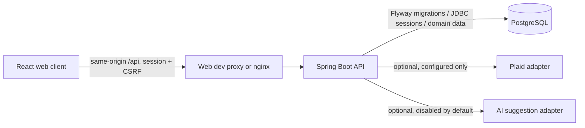

# System overview

HouseSync is a modular monolith: a Java 21/Spring Boot API, a React/TypeScript/Vite mobile-first web client, and PostgreSQL. The backend owns authorization, money rules, and durable state; the browser submits intent and renders authorized projections. This repository documents a local application, **not** an operated public financial service.

`backend/` contains HTTP adapters, application/domain behavior, persistence, migrations and tests. `web/` contains the responsive client and interaction tests. Local Compose starts PostgreSQL by default; the optional `app` profile runs backend and web containers. The web proxy preserves `/api` and `/actuator` prefixes. Flyway owns schema changes and Hibernate validates rather than generating schema. See [local setup](../development/local-setup.md), [testing](../development/testing.md), [deployment boundaries](../development/deployment.md), and [ADR 0001](../decisions/ADR-0001-foundation-stack.md).

## Implemented capabilities and boundaries

| Capability | Contract and evidence entry points |
| --- | --- |
| Session identity, enrollment/recovery grants, CSRF and account-wide session revocation | [Identity API](identity-api.md), [ADR 0002](../decisions/ADR-0002-identity-sessions.md), [security route policy](../../backend/src/main/java/com/housesync/config/SecurityConfiguration.java) |
| Membership-scoped households and capability invitations | [Household API](household-api.md), [Invitation API](invitation-api.md), [ADR 0003](../decisions/ADR-0003-household-membership-context.md), [ADR 0004](../decisions/ADR-0004-capability-household-invitations.md), [ADR 0005](../decisions/ADR-0005-household-membership-lifecycle.md) |
| Private accounts, manual ledger, refunds, disclosure, allocations and spending summaries | [Manual finance API](manual-finance-api.md), [ADR 0006](../decisions/ADR-0006-manual-finance-contracts.md), [ADR 0007](../decisions/ADR-0007-categories-sharing-allocations.md), [account authorization](../../backend/src/main/java/com/housesync/finance/account/application/FinancialAccountService.java) |
| Provider connection/link, private bank inbox, durable sync and explicit posted-entry admission | [Connected finance](connected-finance-contract.md), [ADR 0008](../decisions/ADR-0008-connected-finance.md). Provider integration is environment-dependent; local fake-provider/sandbox checks do not establish live bank coverage. |
| Owner-private categorization evidence, exact rules, review and optional AI suggestions | [Categorization](categorization-contract.md), [ADR 0009](../decisions/ADR-0009-deterministic-categorization.md). AI path is implemented but disabled by default; model quality and production data handling are not certified. |
| Exact unequal allocations, external repayment *records*, contribution views | [Shared finance](shared-finance-contract.md), [ADR 0010](../decisions/ADR-0010-shared-finance.md). No money movement or payment execution. |
| Disclosed-ledger monthly comparisons, recurring evidence/plans, targets and summary | [Financial insights](financial-insights-contract.md), [ADR 0011](../decisions/ADR-0011-financial-insights.md). Plans and targets are intent, not booked or paid obligations. |

HTTP DTOs are not JPA entities or provider SDK objects. Authentication identifies an actor, but current household membership and resource ownership authorize each operation. Household `OWNER` administration does not grant access to another member's private financial accounts, connected observations, rules or reviews. `HOUSEHOLD` transaction disclosure reveals its permitted transaction projection to current and future members, not its source account ID; disclosure and allocation are independent. The backend scopes reads and mutations; the client must reconcile stale scope and session responses rather than treating cached UI authority as a grant.

Money enters as decimal strings and remains `BigDecimal` paired with a supported currency and scale; no implicit FX. Spending is based on confirmed, posted, disclosed ledger records using the household reporting zone. Refunds link to source expenses. Exact shares conserve the source amount with a persisted deterministic refund/allocation policy. Member balances describe obligations, not bank balances; external repayment records are assertions by household parties, not verification of transfer. Database constraints, idempotency keys, version checks, transaction locks and defined lock order protect competing mutations. See [manual](manual-finance-api.md), [shared](shared-finance-contract.md), and [insights](financial-insights-contract.md) contracts for precise inclusion, privacy and concurrency rules.

Connected activity is normalized behind an application-owned adapter; pending and unconfirmed observations do not enter the ledger. Sync uses staged rounds, cursors, durable work and fencing; confirmed owner corrections must not be silently overwritten. Classification precedence favors explicit user decisions, then owner-private exact rules, then supported provider metadata. Heuristic and optional AI output can create review suggestions only; neither can mutate confirmed ledger facts or decide access.

The web implements direct-link navigation, focus recovery, bounded private/household pages, and explicit retry of uncertain writes with retained in-memory intent. A full reload does not preserve that retry intent. Automated and local-browser checks are useful evidence for exercised paths, **not** universal accessibility or production certification. See [design direction](../product/design-direction.md).

## Outside the implemented service boundary

A public hosted service, production backup/restore and erasure assurance, live bank-initiated change/removal verification, human accessibility evaluation, Android client, email ownership/self-service reset, payment processing, and exchange-rate conversion are not established here. The enrollment/recovery operator CLI is implemented, but that is not a public self-service identity system. See [known limits](../product/known-limits.md) and [deployment](../development/deployment.md) for operational limitations.
